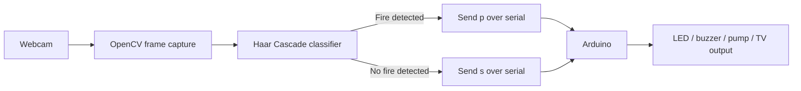

<div align="center">

# 🔥 Fire Detection with OpenCV & Arduino

Real-time fire detection using a Haar Cascade classifier, OpenCV, and Arduino-based alerts and suppression control.

<p>
  
  
  
  
</p>

</div>

## 📌 Overview

This project captures live video from a webcam and uses a Haar Cascade classifier (`cascade.xml`) to identify potential fire regions. When fire is detected, the Python application sends a serial `p` signal to an Arduino. The Arduino activates the connected response devices: an LED, buzzer, water pump, and TV/display output.

When no fire is detected, the Python application sends an `s` signal and the Arduino switches the outputs off.

> **Important:** This is an educational prototype and must not be used as a certified fire-safety or life-safety system. Test pumps, mains-powered devices, and wiring only with appropriate supervision and electrical protection.

## ✨ Features

- 🎥 Real-time webcam video capture with OpenCV
- 🔍 Haar Cascade-based fire-region detection
- 🟥 Bounding boxes around detected regions
- 🔌 Serial communication between Python and Arduino at `9600` baud
- 🚨 LED and buzzer alerts
- 💧 Optional water-pump or solenoid-valve control
- 📺 Optional TV/display output control
- 🖥️ Optional Windows system beep in the enhanced Python script

## 🧰 Hardware

| Component | Purpose | Arduino pin |
|---|---|---:|
| Webcam or camera | Captures the video stream | — |
| Arduino board | Receives serial commands and controls outputs | — |
| LED | Visual alert | 12 |
| Buzzer | Audible alert | 11 |
| Water pump / solenoid valve | Optional suppression response | 13 |
| TV / display control | Optional additional response | 10 |
| USB cable | Serial communication and power | — |
| Breadboard, wires, and suitable power supply | Circuit assembly | — |

Use appropriate driver circuits, relays, flyback protection, and an external power supply for pumps, valves, or other high-current loads. Do not connect high-power devices directly to Arduino pins.

## 🗂️ Project Structure

```text
.
├── cascade.xml
├── python code for fire detection.py       # Enhanced script with image adjustment and Windows beep
├── python code for fire detection2.py      # Basic detection script
├── Arduino_code_for_response/
│   └── ardino/
│       └── ardino.ino
└── README.md
```

## ⚙️ Requirements

- Python 3.x
- Arduino IDE
- Arduino-compatible board
- USB-connected webcam
- `opencv-python`
- `pyserial`
- `numpy`
- Windows is required for `python code for fire detection.py` if the `winsound` alert is enabled

## 🚀 Installation

1. Clone the repository:

   ```bash
   git clone https://github.com/Sandipan2011/Fire-Detection-using-HAAR-Cascade-Classifier-in-OpenCV-main.git
   cd Fire-Detection-using-HAAR-Cascade-Classifier-in-OpenCV-main
   ```

2. Create and activate a virtual environment (recommended):

   ```bash
   python -m venv .venv
   ```

   **Windows PowerShell:**

   ```powershell
   .\.venv\Scripts\Activate.ps1
   ```

   **macOS/Linux:**

   ```bash
   source .venv/bin/activate
   ```

3. Install the Python dependencies:

   ```bash
   python -m pip install opencv-python pyserial numpy
   ```

## 🔧 Arduino Setup

1. Open [`Arduino_code_for_response/ardino/ardino.ino`](Arduino_code_for_response/ardino/ardino.ino) in the Arduino IDE.
2. Select the correct board and USB port.
3. Upload the sketch to the Arduino.
4. Connect the output hardware according to the pin table above.
5. Close the Arduino Serial Monitor before starting Python; the serial port should be available to only one application.

The Arduino listens for these commands:

| Command | Meaning | Result |
|---|---|---|
| `p` | Potential fire detected | Turns on LED, buzzer, pump, and TV output for the configured response cycle |
| `s` | No fire detected | Turns all response outputs off |

## ▶️ Run the Detector

Before running either script, update the serial port in the source code to match your system. The repository currently contains examples using `COM4` and `COM5`:

```python
ser1 = serial.Serial("COM4", 9600)
```

Start the enhanced detector:

```bash
python "python code for fire detection.py"
```

Or start the basic detector:

```bash
python "python code for fire detection2.py"
```

- The camera opens automatically using device index `0`.
- A detected region is highlighted in red.
- Press **Esc** to stop the application.
- If the camera does not open, try changing `cv2.VideoCapture(0)` to another camera index.

## 🧪 How It Works



1. OpenCV captures a frame from the webcam.
2. The frame is processed by `cascade.xml`.
3. Detected regions are drawn on the preview window.
4. Python sends `p` or `s` to the Arduino over serial.
5. The Arduino switches the response outputs accordingly.

## 🛠️ Troubleshooting

### Serial port error

- Confirm the Arduino is connected.
- Check the port in the Arduino IDE and update the Python script.
- Close any application currently using the port.
- Confirm that both Python and Arduino use `9600` baud.

### Camera does not open

- Check camera permissions and USB connections.
- Try a different camera index, such as `1`.
- Close other applications using the webcam.

### Detection is inaccurate

- Ensure `cascade.xml` is in the same directory as the Python script.
- Improve lighting and camera positioning.
- Adjust the `detectMultiScale` parameters for your environment.
- A Haar Cascade is not a substitute for a production-grade fire detection model or sensor.

### `winsound` import or beep error

Use `python code for fire detection2.py`, or run the enhanced script on Windows with the `winsound` section enabled.

## 🤝 Contributing

Contributions are welcome. You can improve the project by adding configurable command-line options, cross-platform audio alerts, safer hardware drivers, automated tests, or a more robust fire-detection model.

1. Fork the repository.
2. Create a feature branch.
3. Commit your changes with a clear message.
4. Open a pull request describing the change and test results.

## 📄 License

No license file is currently included in this repository. Add a license before redistributing or using this project in another project.

## 👤 Author

Created by [Sandipan2011](https://github.com/Sandipan2011).
